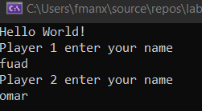
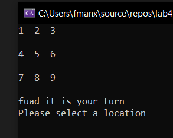
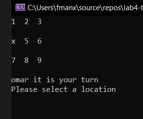
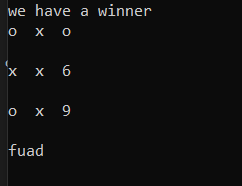

# Lab: 04 - Classes & Objects (tic-tac-toe)

this project is a game tic-tac-toe with two Players  

## some deiales 

this project created on OOP as Classes and Objects and it have commint on methods to tell any one how want to use the code how it work.

## way to use it

after you clone this proram and star it

1. it will ask you to enter the name of the player 1 & 2

2. start the game turns

3. if the one of the player win it will eend the game and print the winner name 

